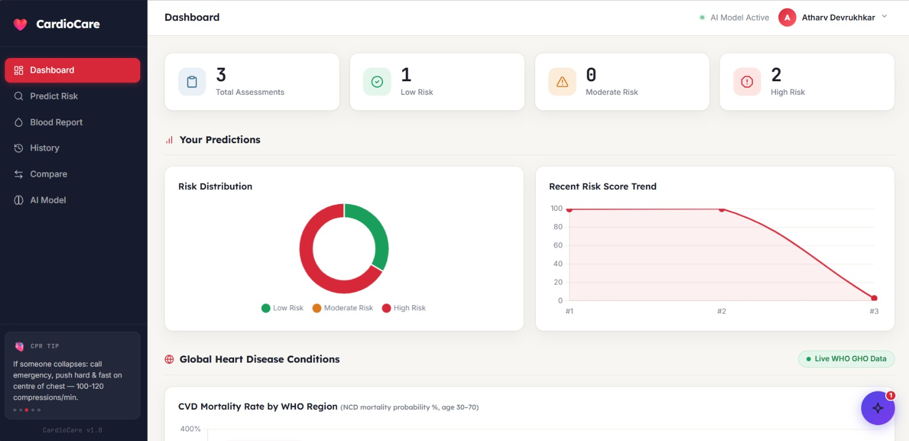
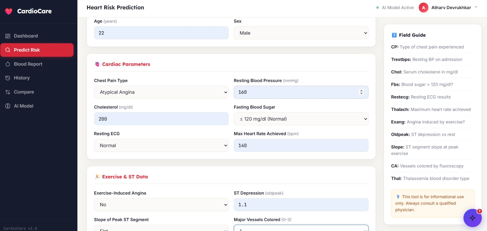
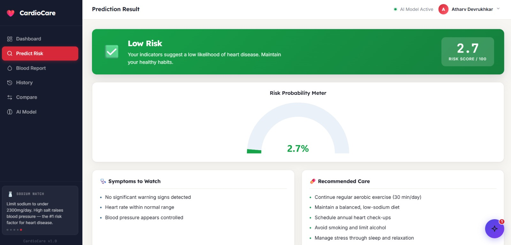
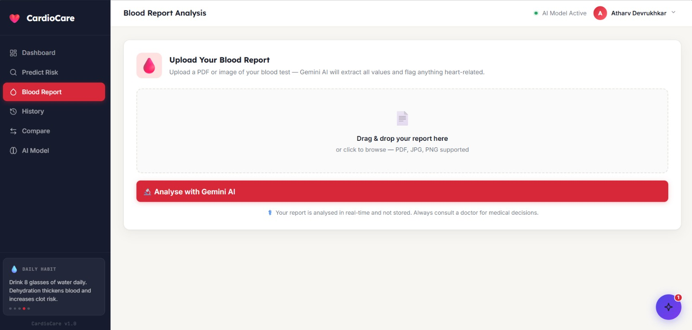
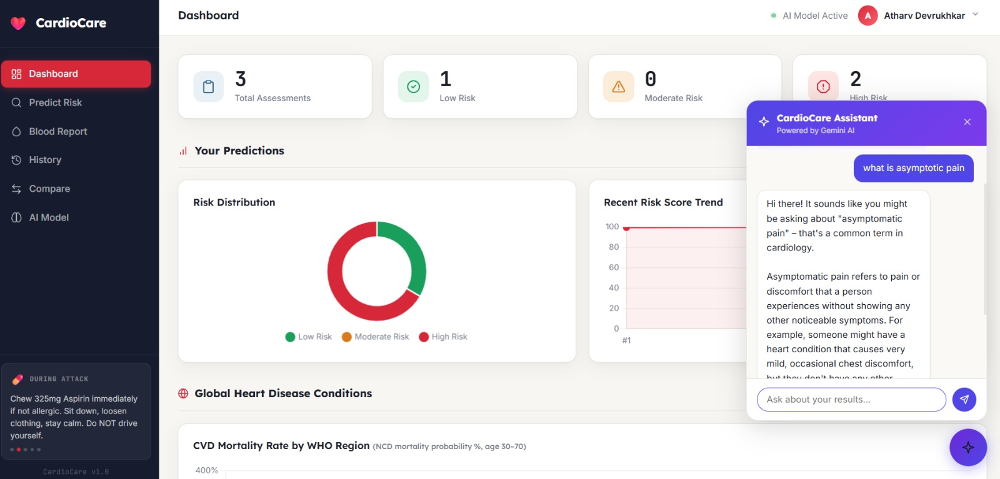
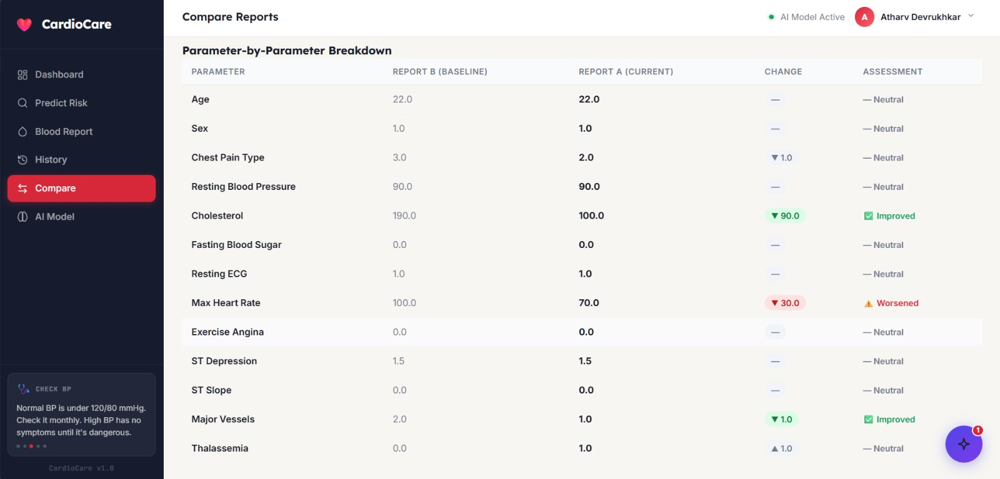
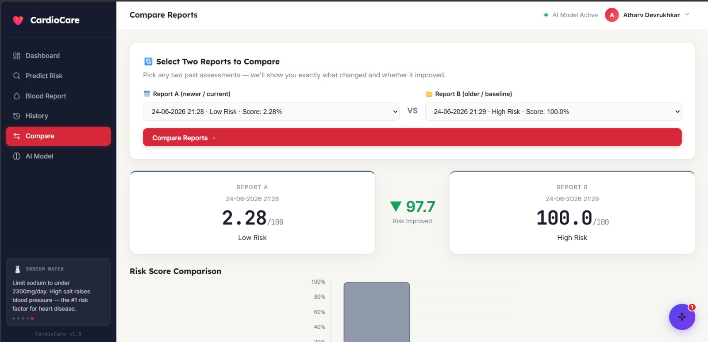

# ❤️ CardioCare - AI Heart Risk Prediction Platform

CardioCare is a full-stack AI healthcare analytics application that predicts cardiovascular disease risk and provides AI-powered health insights using Machine Learning and Gemini AI.

## 🚀 Features

- 🧠 Heart disease risk prediction using Deep Learning
- 🩸 Blood report analysis using Gemini Vision AI
- 🤖 AI chatbot for explaining medical values
- 📊 Interactive health dashboard
- 📈 Prediction history and report comparison
- 📄 Automatic PDF report generation


## 🛠 Tech Stack

**Frontend**
- HTML
- CSS
- JavaScript
- Chart.js

**Backend**
- Flask
- MongoDB
- REST APIs

**Machine Learning**
- TensorFlow / Keras
- Scikit-learn
- NumPy / Pandas

**AI**
- Google Gemini API
- Gemini Vision

**Deployment**
- Docker
- Render


## 🧠 AI Model

Dataset: UCI Cleveland Heart Disease Dataset

Architecture:

```
Input Layer
    ↓
Dense(128) + ReLU
    ↓
BatchNorm + Dropout
    ↓
Dense(64) + ReLU
    ↓
Dense(32) + ReLU
    ↓
Sigmoid Output
```

- 13 clinical features
- Binary classification model
- Risk probability output (0-100%)


## 📂 Project Structure

```bash
cardiocare/
│
├── app.py
├── config.py
├── requirements.txt
│
├── model/
│   ├── train_model.py
│   └── saved_model/
│
├── utils/
│   ├── predictor.py
│   ├── blood_analyser.py
│   ├── gemini_chat.py
│   └── pdf_generator.py
│
├── static/
├── templates/
├── dataset/
└── reports/
```


## 📸 Screenshots

### Dashboard


### Risk Prediction



### Gemini Blood Report Analysis


### AI Assistant


### Report Comparison



## ⚙️ Setup

Clone repository:

```bash
git clone <repo-url>
cd cardiocare
```

Install packages:

```bash
pip install -r requirements.txt
```

Add environment variables:
GEMINI_API_KEY=your_gemini_api_key
MONGO_URI=your_mongodb_connection_string

Run:

```bash
python app.py
```


## ⚠️ Disclaimer

CardioCare is an educational AI project and should not replace professional medical advice.


## 👨‍💻 Developer

**Atharv Devrukhkar**

Machine Learning | Data Science | Data Analysis